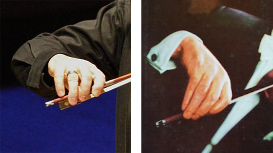

Here it's presented the first attempt at playing both pieces at 80bpm. 

There are clear mistakes, but I am also trying to correct the right hand grip. Right now I am grabing the bow more like in the **Russian** method (*right side of image*), but I am trying to do it like the **Franco-Belgian** one (*left side of image*).

### Étude N. 12 Laoureux Book II 80bpm

<iframe width="560" height="315" src="https://www.youtube.com/embed/chLS_fcL3Qs" frameborder="0" allow="accelerometer; autoplay; clipboard-write; encrypted-media; gyroscope; picture-in-picture" allowfullscreen></iframe>

### Concerto Op. 3 N. 6 I. Allegro Vivaldi 80bpm

> **Suggestion**: Watch it at 2x 😉

<iframe width="560" height="315" src="https://www.youtube.com/embed/tqZ7fQSnrXw" frameborder="0" allow="accelerometer; autoplay; clipboard-write; encrypted-media; gyroscope; picture-in-picture" allowfullscreen></iframe>