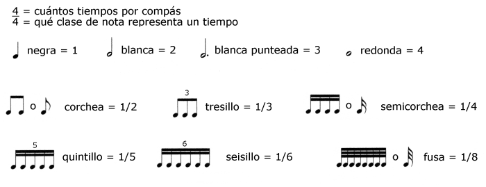
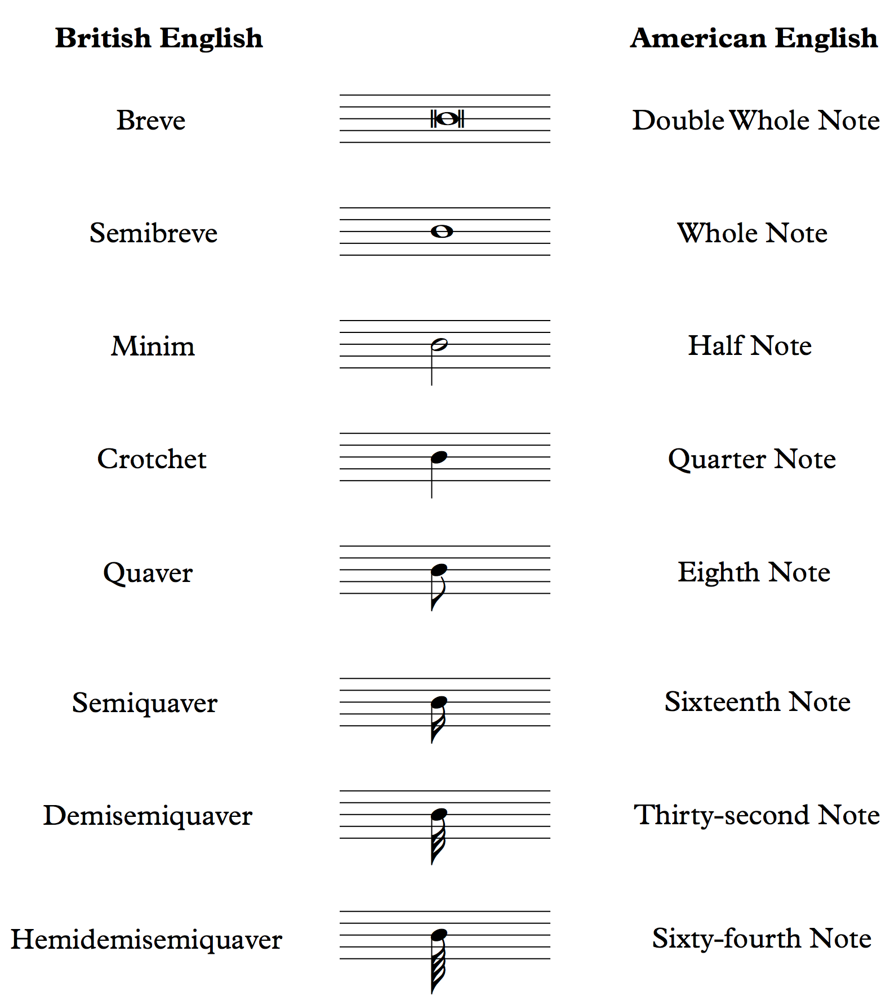

### Trills

In order to understand the exercises practiced the following images will be useful.

> **Corchea/Quaver/Eighth note**

In this setup we try to play **two** notes per compass (marked by the metronome).

<iframe width="560" height="315" src="https://www.youtube.com/embed/r6AEIzZs1Wc" frameborder="0" allow="accelerometer; autoplay; clipboard-write; encrypted-media; gyroscope; picture-in-picture" allowfullscreen></iframe>

> **Tresillo/Triplet**

In this setup we try to play **three** notes per compass.

<iframe width="560" height="315" src="https://www.youtube.com/embed/u9mBN2FK-og" frameborder="0" allow="accelerometer; autoplay; clipboard-write; encrypted-media; gyroscope; picture-in-picture" allowfullscreen></iframe>

> **Semi corchea/Semiquaver/Sixteenth note**

In this setup we try to play **four** notes per compass.

<iframe width="560" height="315" src="https://www.youtube.com/embed/IpF-vBW129U" frameborder="0" allow="accelerometer; autoplay; clipboard-write; encrypted-media; gyroscope; picture-in-picture" allowfullscreen></iframe>

> **Seisillo/Sextuplet**

In this setup we try to play **six** notes per compass.

<iframe width="560" height="315" src="https://www.youtube.com/embed/FTjtMra4xeE" frameborder="0" allow="accelerometer; autoplay; clipboard-write; encrypted-media; gyroscope; picture-in-picture" allowfullscreen></iframe>

> **Fusa/Demisemiquaver/Thirty-second Note**

In this setup we try to play **eighth** notes per compass.

<iframe width="560" height="315" src="https://www.youtube.com/embed/pIViIIshTF4" frameborder="0" allow="accelerometer; autoplay; clipboard-write; encrypted-media; gyroscope; picture-in-picture" allowfullscreen></iframe>