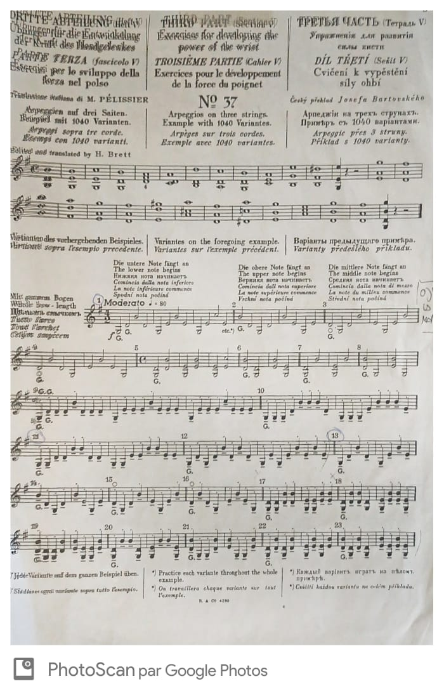
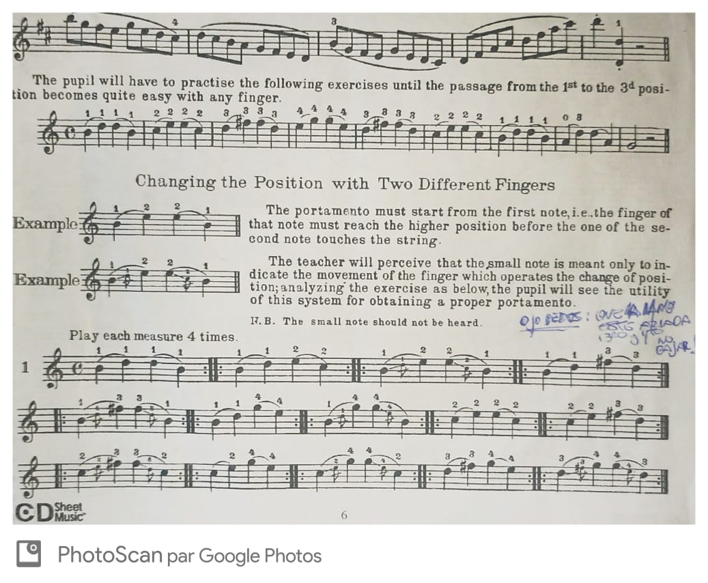
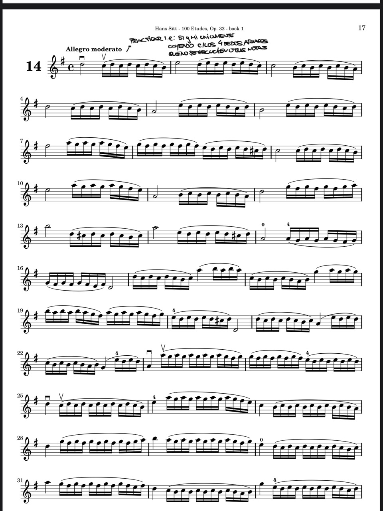
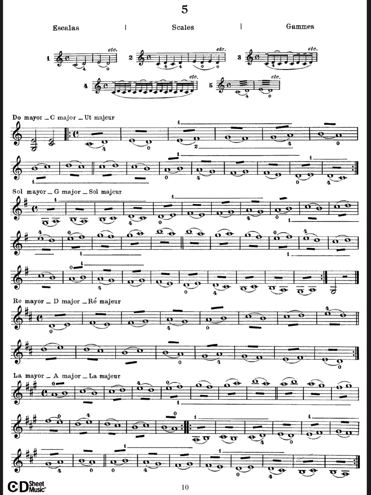
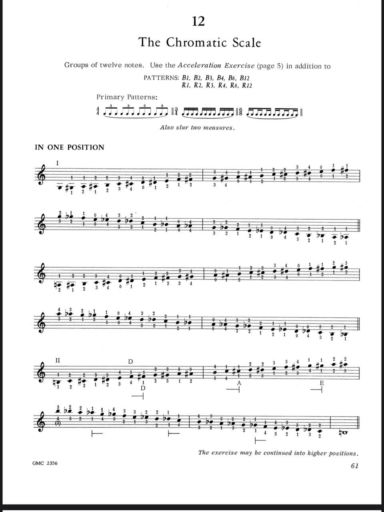
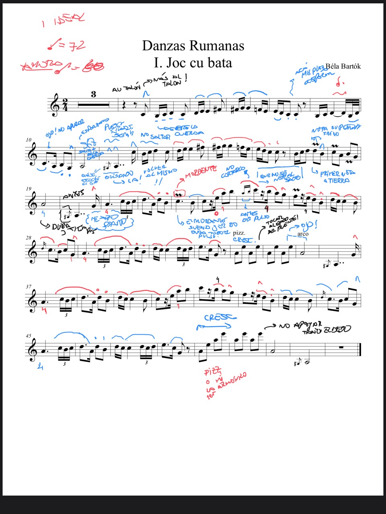

### Practice Sessions

This new section aims to showcase the kind of things that I am practicing along the week.

> Technique

- **Bowing**: School of Bowing, Op. 2 Part. III by Otakar Ševčík

- **Glisandos**: A practical Method for the Violin Part 2 by Nicolas Laoureux (3rd position)

- 100 Etudes Op. 32, Book 1 by Hans Sitt

- **Trills**: Preparatory Trill Studies Op.7 Part 1 by Otakar Ševčík

- **Chromatic Scale**: Contemporary Violin Technique Vol 1 Part 1 by Galamian et al.

> Pieces

- Danzas rumanas I. Joc cu bata by Béla Bartók

- Concerto Op.3 I.Allegro by Antonio Vivaldi

### Chromatic Scale

> **1st variation**: 1122334. This marks the left-hand fingers played.

<iframe width="560" height="315" src="https://www.youtube.com/embed/DzcXzckrdFc" frameborder="0" allow="accelerometer; autoplay; clipboard-write; encrypted-media; gyroscope; picture-in-picture" allowfullscreen></iframe>

<iframe width="560" height="315" src="https://www.youtube.com/embed/oKc22KS_GhM" frameborder="0" allow="accelerometer; autoplay; clipboard-write; encrypted-media; gyroscope; picture-in-picture" allowfullscreen></iframe>

<iframe width="560" height="315" src="https://www.youtube.com/embed/CUV-nMOwYds" frameborder="0" allow="accelerometer; autoplay; clipboard-write; encrypted-media; gyroscope; picture-in-picture" allowfullscreen></iframe>

> **2nd variation**: 1212340.

<iframe width="560" height="315" src="https://www.youtube.com/embed/KPBO6tSquwk" frameborder="0" allow="accelerometer; autoplay; clipboard-write; encrypted-media; gyroscope; picture-in-picture" allowfullscreen></iframe>

<iframe width="560" height="315" src="https://www.youtube.com/embed/-fBxuKxmQ2E" frameborder="0" allow="accelerometer; autoplay; clipboard-write; encrypted-media; gyroscope; picture-in-picture" allowfullscreen></iframe>

<iframe width="560" height="315" src="https://www.youtube.com/embed/7xOlJ8rSEE0" frameborder="0" allow="accelerometer; autoplay; clipboard-write; encrypted-media; gyroscope; picture-in-picture" allowfullscreen></iframe>

### Danzas rumanas I. Joc cu bata by Béla Bartók

> 80 bpm

<iframe width="560" height="315" src="https://www.youtube.com/embed/P3YVFaVAS9M" frameborder="0" allow="accelerometer; autoplay; clipboard-write; encrypted-media; gyroscope; picture-in-picture" allowfullscreen></iframe>

> 100 bpm

<iframe width="560" height="315" src="https://www.youtube.com/embed/EqZ4SulmN20" frameborder="0" allow="accelerometer; autoplay; clipboard-write; encrypted-media; gyroscope; picture-in-picture" allowfullscreen></iframe>