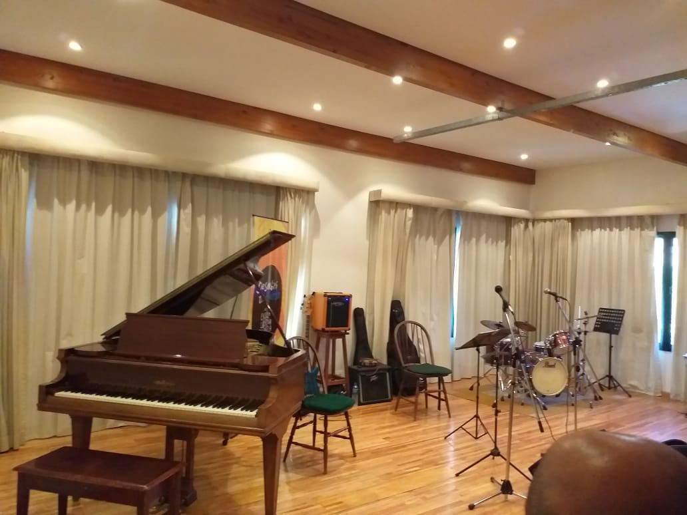
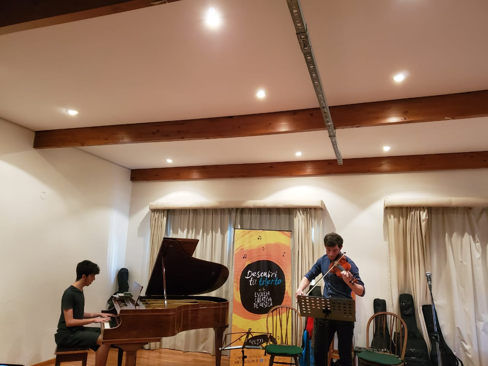
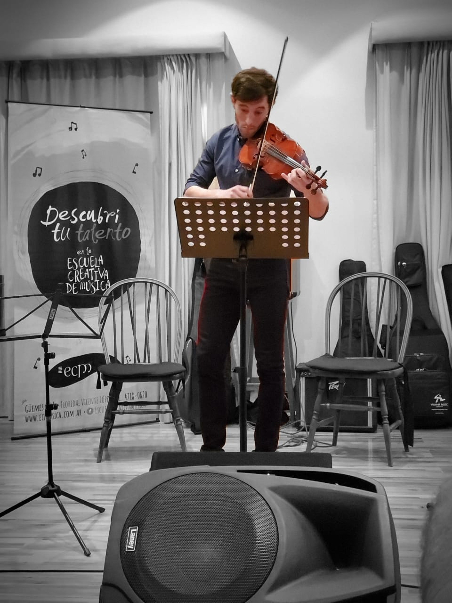

## Pieces played:

- **Petite ecole de la mélodie**: 20 petites pièces très faciles pour le violon avec accomp. de piano en 3 suites by *Charles Dancla* Op.123 Suite 1 Romance.

- **Very Easy Melodious Exercises in the First Position** by *Edward Elgar* Op.22: n.1

<object data="./dancla.pdf" type="application/pdf" width="700px" height="700px">
    <embed src="./dancla.pdf">
        
This browser does not support PDFs. Please download the PDF to view it: <a href="./dancla.pdf">Download PDF</a>.

    </embed>
</object>

<object data="./elgar.pdf" type="application/pdf" width="700px" height="700px">
    <embed src="./elgar.pdf">
        
This browser does not support PDFs. Please download the PDF to view it: <a href="./elgar.pdf">Download PDF</a>.

    </embed>
</object>

----

## Practicing

### Petite école de la mélodie: 12 petites pièces by Charles Dancla Op. 123 N. 1 Romance

Filmed: 2019 - Nov - 17

<iframe width="560" height="315" src="https://www.youtube.com/embed/rupT7qI6Oc0" frameborder="0" allow="accelerometer; autoplay; encrypted-media; gyroscope; picture-in-picture" allowfullscreen></iframe>

